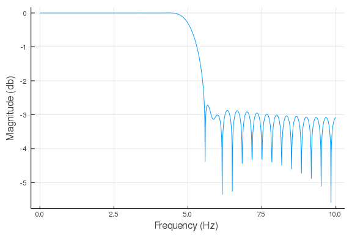

# **Least Squares**

In this lecture, we will cover least squares for data fitting, linear systems, properties of least squares and QR factorization.

## **Least squares for data fitting**

Consider the problem of fitting a line to observations $y_i$ gven input $z_i,\ i = 1,\dots, n$.


<center>


</center>

DSP.jl package doesn't (yet) have a method to calculate the
the frequency response of a FIR filter so we define it:

````julia
using Plots, DSP
gr()

function FIRfreqz(b::Array, w = range(0, stop=π, length=1024))
    n = length(w)
    h = Array{ComplexF32}(undef, n)
    sw = 0
    for i = 1:n
      for j = 1:length(b)
        sw += b[j]*exp(-im*w[i])^-j
      end
      h[i] = sw
      sw = 0
    end
    return h
end
````


````
FIRfreqz (generic function with 2 methods)
````


## Design Lowpass FIR filter


Designing a lowpass FIR filter is very simple to do with DSP.jl, all you
need to do is to define the window length, cut off frequency and the
window. We will define a lowpass filter with cut off frequency at 5Hz for a signal
sampled at 20 Hz.
We will use the Hamming window, which is defined as:
$w(n) = \alpha - \beta\cos\frac{2\pi n}{N-1}$, where $\alpha=0.54$ and $\beta=0.46$

````julia
fs = 20
f = digitalfilter(Lowpass(5, fs = fs), FIRWindow(hamming(61)))
w = range(0, stop=pi, length=1024)
h = FIRfreqz(f, w)
````


````
1024-element Array{Complex{Float32},1}:
                      1.0f0 + 0.0f0im          
               0.99546844f0 + 0.095055714f0im  
               0.98191506f0 + 0.1892486f0im    
               0.95946306f0 + 0.28172377f0im   
                0.9283168f0 + 0.37164196f0im   
                0.8887594f0 + 0.45818728f0im   
               0.84115064f0 + 0.54057467f0im   
                0.7859234f0 + 0.618057f0im     
               0.72357976f0 + 0.6899319f0im    
               0.65468615f0 + 0.7555481f0im    
                            ⋮                  
            0.00043952762f0 - 0.00041908873f0im
             0.0005152718f0 - 0.00040521423f0im
             0.0005873293f0 - 0.00037745363f0im
             0.0006531789f0 - 0.0003367371f0im 
             0.0007105166f0 - 0.00028444792f0im
             0.0007573364f0 - 0.00022237403f0im
             0.0007920005f0 - 0.00015264557f0im
  0.0008132961f0 - 7.766036f-5im               
 0.0008204784f0 - 3.1148685f-18im
````


## Plot the frequency and impulse response


The next code chunk is executed in term mode, see the [script](FIR_design.jl) for syntax.

````julia
julia> h_db = log10.(abs.(h));

julia> ws = w/pi*(fs/2)
0.0:0.009775171065493646:10.0

````


````julia
plot(ws, h_db,
      xlabel = "Frequency (Hz)", ylabel = "Magnitude (db)")
````


And again with default options

````julia
h_phase = unwrap(-atan.(imag.(h),real.(h)))
plot(ws, h_phase,
    xlabel = "Frequency (Hz)", ylabel = "Phase (radians)")
````



